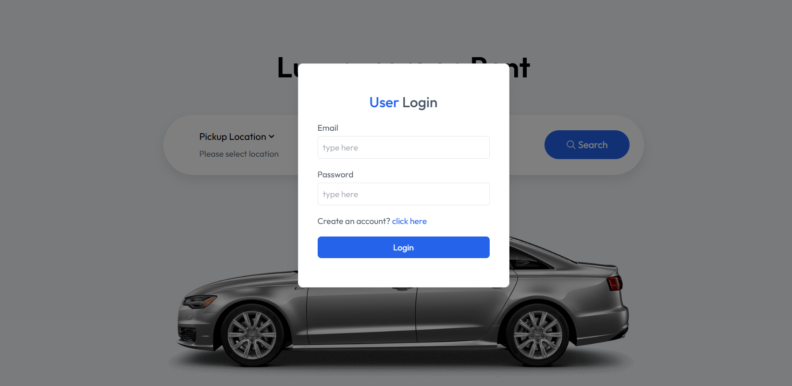
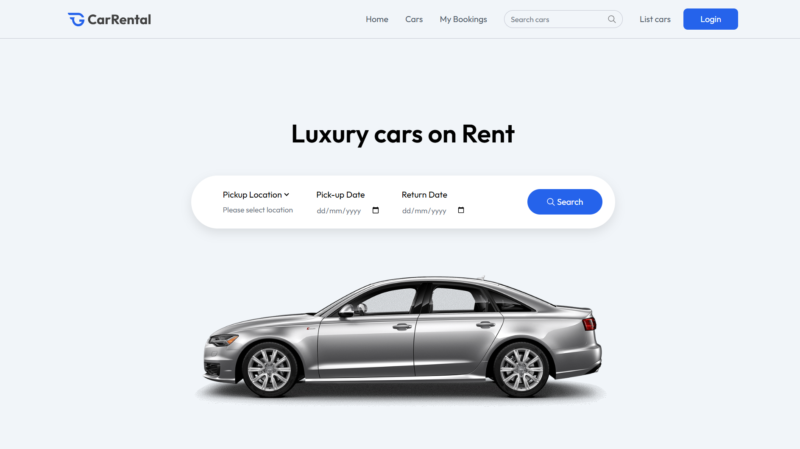
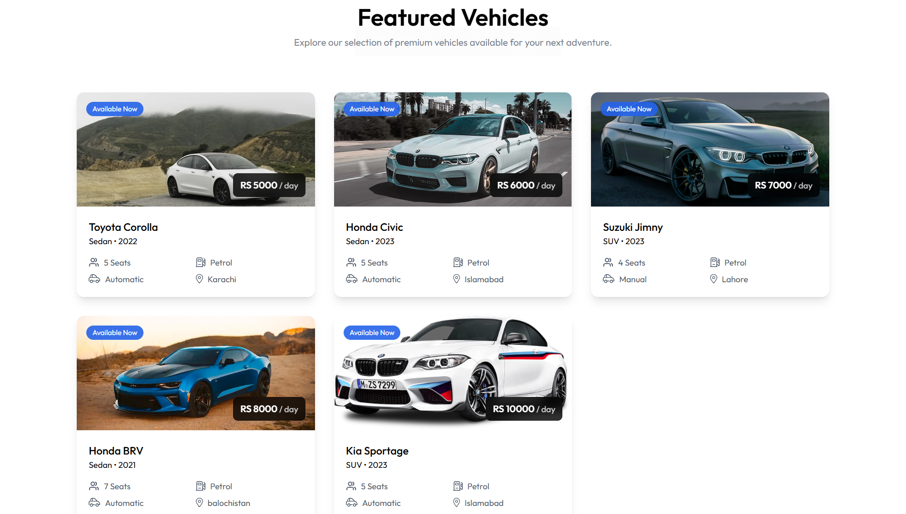
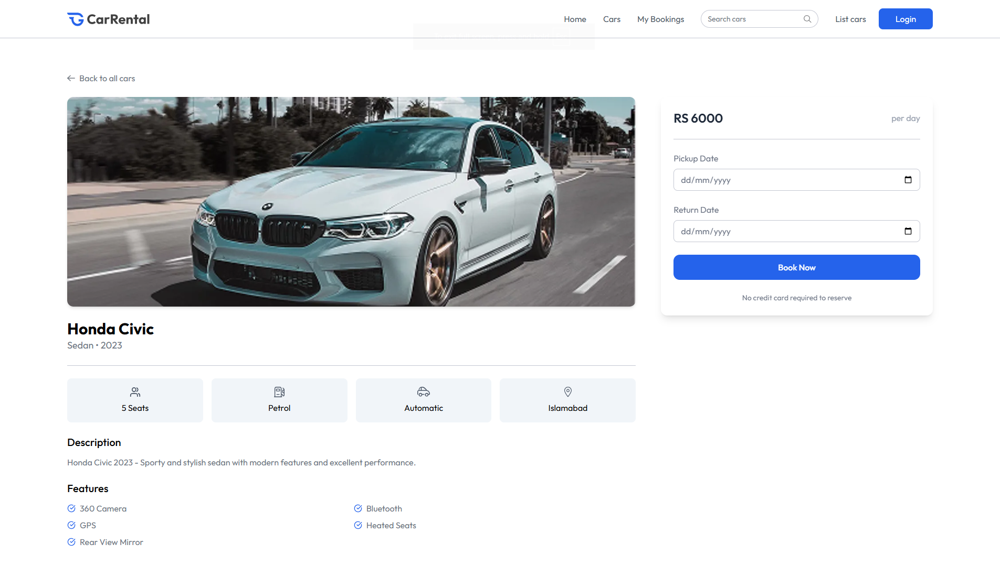
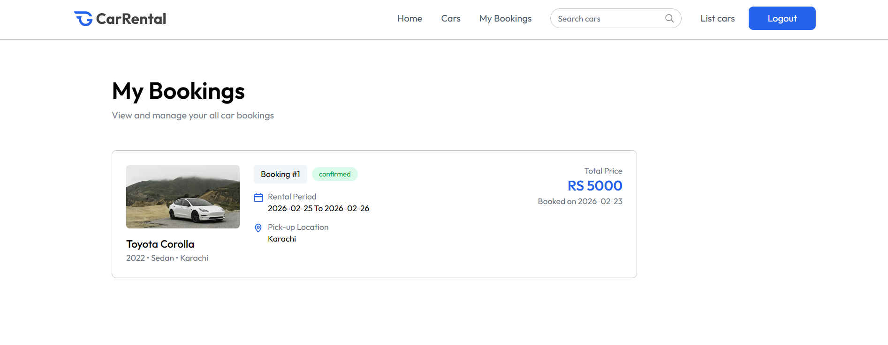
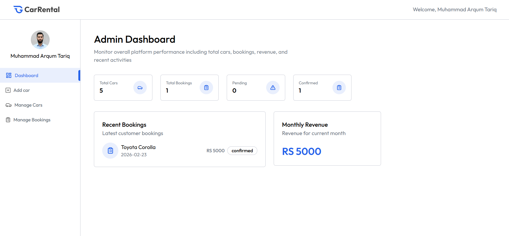
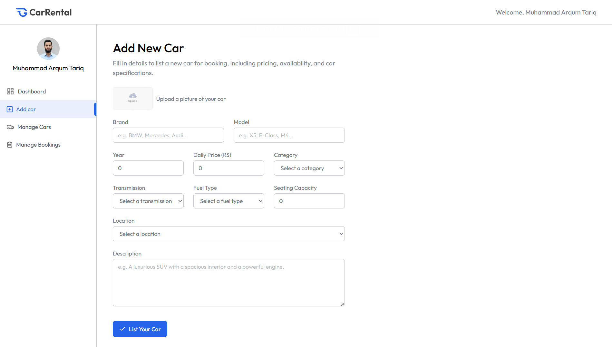
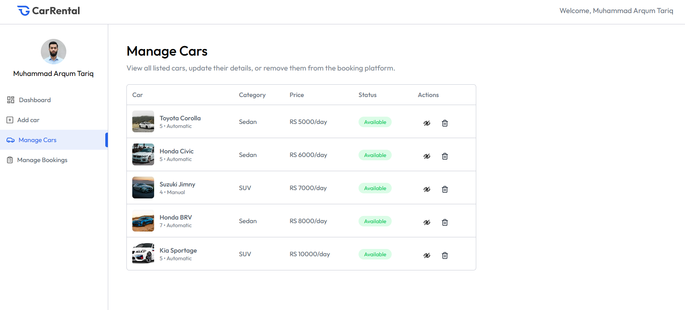
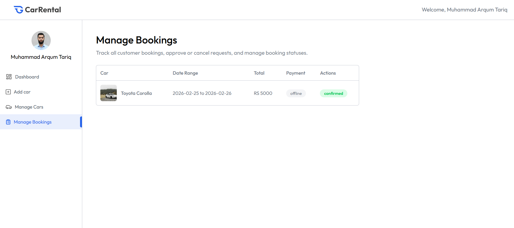

<!--
  SEO KEYWORDS: Car Rental Booking App, MERN Stack Car Rental, Vehicle Booking Platform Pakistan,
  Full Stack Car Rental System, React Car Rental, Node.js Booking System, MongoDB Vehicle Rental,
  Online Car Booking Website, Car Rental Management System, Owner Dashboard Car Rental,
  MERN Stack Pakistan, Custom Booking Platform, Innoze, Innoze Tech, Software House Pakistan,
  Car Rental Web App, Vehicle Management System, JWT Authentication Booking App
-->

<h1>🚗 Car Rental Booking Platform</h1>

A production-ready, full-stack <strong>Car Rental & Vehicle Booking System</strong> built by <strong><a href="https://github.com/innozetech">Innoze</a></strong> — where users browse & book vehicles and owners manage listings, bookings, and revenue from one powerful dashboard.

---

## 🎯 The Problem

Car rental businesses face these challenges daily:

- ❌ No proper online platform to list and manage vehicles
- ❌ Bookings handled manually via calls & WhatsApp — leading to errors
- ❌ No real-time visibility into revenue, active bookings, or availability
- ❌ Customers have no way to browse, filter, or book cars online
- ❌ No centralized system for owners to manage multiple listings

---

## ✅ Our Solution

**Innoze** built a complete two-sided car rental platform — one side for **customers** to browse and book, and one side for **owners** to list vehicles, manage bookings, and track revenue — all in one seamless system.

> A car rental business can now run their entire operation digitally — no spreadsheets, no manual calls, no confusion.

---

## 💼 Business Impact

| Before | After |
|:-------|:------|
| Manual booking via WhatsApp/calls | ✅ Automated online booking system |
| No visibility into revenue | ✅ Real-time revenue dashboard |
| Cars listed on random platforms | ✅ Centralized vehicle management |
| No customer database | ✅ Complete booking history & user data |
| Lost bookings due to availability confusion | ✅ Real-time availability toggling |
| Poor or no mobile experience | ✅ Fully responsive across all devices |

---

## ✨ Key Features

### 👤 Customer Experience
- 🔐 Secure registration & login with JWT
- 🚗 Browse all available vehicles with images & details
- 🔍 Smart filters — by location, category & price range
- 📅 Select pickup & return dates — instant booking
- 📋 Full booking history & status tracking
- 📱 Fully responsive — mobile, tablet & desktop

### 🏢 Owner Control Panel
- 🔑 Dedicated owner authentication portal
- 📊 Dashboard — revenue stats, total bookings, active listings
- ➕ List new cars with images, specs, price & category
- 🔧 Edit, toggle availability & delete listings
- 📂 View & manage all customer bookings
- 🖼️ Cloud-based image storage via ImageKit CDN

---

## 🛠️ Tech Stack

| Layer | Technology |
|:------|:-----------|
| **Frontend** | React 19, Vite, Tailwind CSS, React Router |
| **Backend** | Node.js, Express.js |
| **Database** | MongoDB Atlas, Mongoose |
| **Auth** | JWT (JSON Web Tokens), bcrypt |
| **Media Storage** | ImageKit CDN |
| **Deployment** | Vercel |

---

## 📸 Project Screenshots

### 👤 User Panel

<table>
  <tr>
    <td align="center">
      
       
      <b>🔐 User Login</b>
    </td>
    <td align="center">
      
       
      <b>🚗 Hero Section</b>
    </td>
  </tr>
  <tr>
    <td align="center">
      
       
      <b>🚘 Browse Vehicles</b>
    </td>
    <td align="center">
      
       
      <b>📅 Book a Car</b>
    </td>
  </tr>
  <tr>
    <td align="center" colspan="2">
      
       
      <b>📋 My Bookings</b>
    </td>
  </tr>
</table>

### 🏢 Owner Panel

<table>
  <tr>
    <td align="center">
      
       
      <b>📊 Revenue Dashboard</b>
    </td>
    <td align="center">
      
       
      <b>➕ Add New Car</b>
    </td>
  </tr>
  <tr>
    <td align="center">
      
       
      <b>🔧 Manage Listings</b>
    </td>
    <td align="center">
      
       
      <b>📂 Manage Bookings</b>
    </td>
  </tr>
</table>

---

## 🌟 Why Innoze Built This

At **Innoze**, we engineer solutions that solve real business problems. This platform was designed to give car rental businesses a **complete digital operation** — from customer-facing booking to backend revenue management — all built to scale.

> This project demonstrates our capability to build **multi-role, production-ready platforms** with clean architecture and real-world business logic.

---

## 🤝 Want a Similar Solution for Your Business?

> Need a booking platform, rental system, or any custom web application?
>
> **Innoze is here to build it, design it, and grow it with you.**

 

&nbsp;

---

  Built with ❤️ by <strong><a href="https://github.com/innozetech">Innoze</a></strong> — Karachi, Pakistan 🇵🇰

